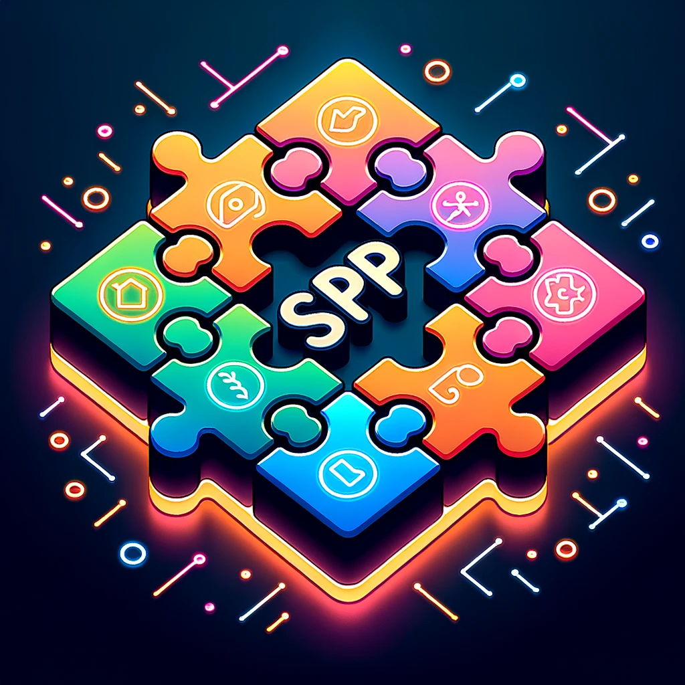

# Smallest Possible Product (SPP) Platform

Welcome to the Smallest Possible Product (SPP) platform! Our mission is to embrace simplicity in application design by encouraging developers to create standalone products that address a single issue exceptionally well. If you believe in sharp-focused solutions and rapid prototyping, you've found the right place.

    

---

## Why SPP?

- **Fast Iteration**: By concentrating on a singular function, developers can rapidly iterate over their products, ensuring that they're always improving and adapting to user needs.
  
- **Measure ROI**: Simplified products mean simplified metrics. With a clear focus, it's easier to measure the impact and success of your application.
  
- **Have Fun**: There's joy in simplicity. Tackling one problem and solving it well can be both challenging and incredibly satisfying.
  
- **Collaborate**: Open-source by nature, the SPP community thrives on collaboration. Share your idea, get feedback, and refine together.
  
- **Lean Development**: Avoid bloated applications. By focusing on creating the smallest possible product, you save time, resources, and avoid unnecessary complexities.

---

## Principles

1. **Simplicity**: Each product should be intuitive and easy to use.
2. **Single-purpose**: Every app should be designed to address just one problem but do it exceptionally well.
3. **Open-source**: Promote transparency and collaboration by making the code available for all.

---

## Getting Started

While we're in the early stages and the development tools are on their way, here's how you can get involved:

1. **Join the Community**: Get to know fellow developers, share your ideas, and discuss potential SPPs.
2. **Sketch Your Idea**: Start with a simple sketch or a mock-up. Remember, the goal is to keep it as minimalistic as possible.
3. **Feedback Loop**: Share your idea with the community, gather feedback, and refine.

---

## Contribute

The success of the SPP platform hinges on its community. Even if you're not building an SPP right now, there are many ways you can contribute:

- **Documentation**: Help in creating tutorials, guides, or even improving this README.
- **Code Review**: As our platform grows, we'll need experienced developers to help review code and ensure the quality of SPPs.
- **Promote**: The more people know about SPP, the richer our community will be. Share on social media, write about your experiences, or host workshops.

---

## Future Roadmap

While we're still setting the foundational bricks, here's a glimpse of what's coming:

- An integrated development environment for building and testing SPPs.
- A dedicated repository manager for storing and categorizing SPPs.
- Collaboration tools for seamless teamwork and communication.

---

## Join Us!

The journey towards creating impactful, single-purpose products is thrilling. If you're excited about the idea of doing more with less, join us in making the SPP vision a reality.

--- 

**Note**: Feel free to share your thoughts, questions, or any feedback. Let's build a community that believes in the power of simplicity.

--- 

## License

This project is open-source, licensed under [MIT License](LICENSE.md).

--- 

Happy Building! 🚀
